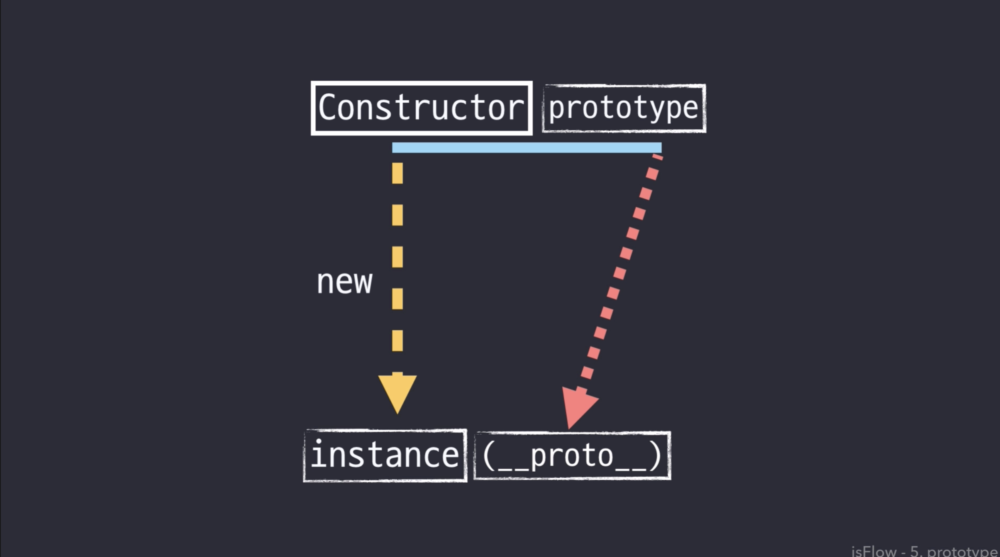
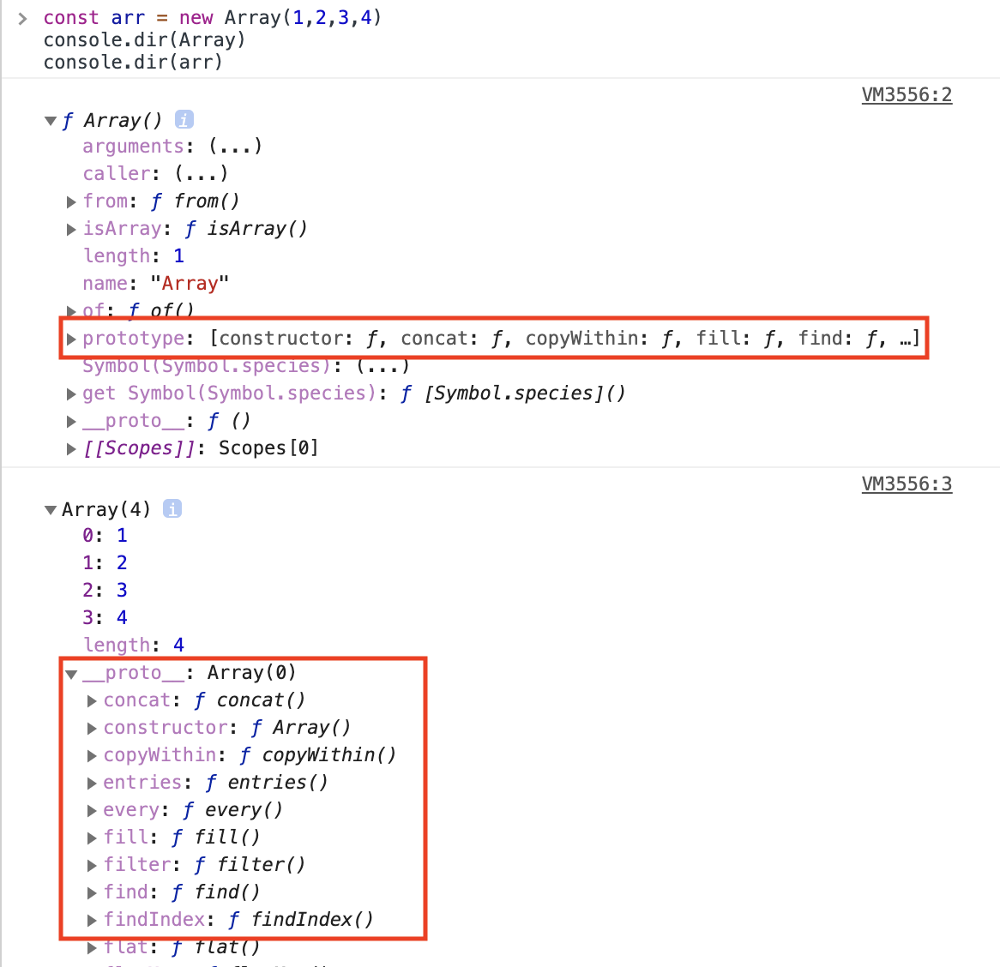
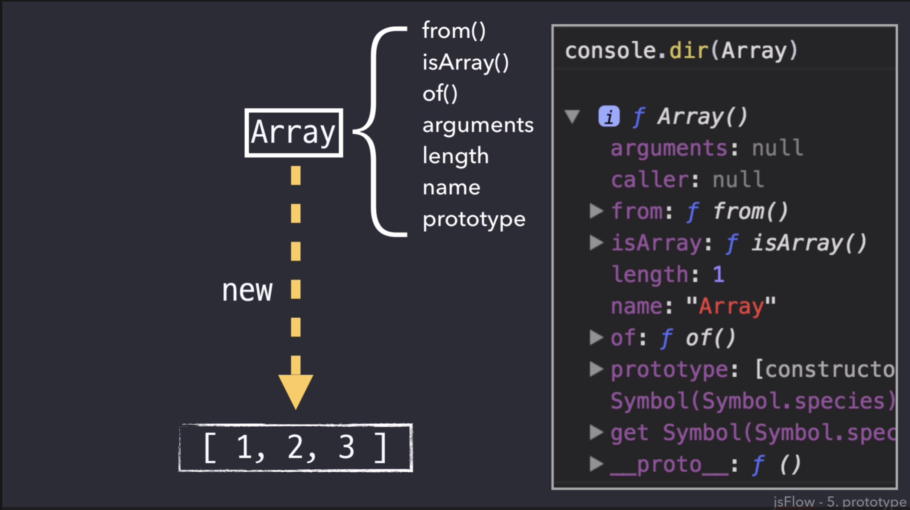

# 16.new, Constructor, instanceof and Instances

## Instances
- "인스턴스(instance)" 라는 용어는 "객체(object)" 와 유사함,
- "객체"는 좀 더 일반적인 의미인 반면 "인스턴스" 라고 표현하면 "현재 생성된 바로 그 객체"

## new, Constructor
- Constructor을 부여받아야만 new를 통해 객체를 만들 수 있다. 이것이 오로지 함수만 new 키워드를 사용할 수 있는 이유
```
function Student(name, age) { // Constructor
  this.name = name;
  this.age = age;
}

var first = new Student('John', 26); // instance
console.log(first.name);
// John
```



1. Constructor 함수가 new 연산자를 만나면 instance를 생성.
2. instance가 생성되면 Constructor의 프로퍼티인 prototype을 instance의 __proto__에 전달
3. prototype이 과 __proto__은 같은 객체를 참조
4. __proto__에 접근할 때 생략가능

### Array 객체 예시




## instanceof
- instanceof 연산자는 생성자의 prototype 속성이 객체의 프로토타입 체인 어딘가 존재하는지 판별합니다.

```
console.log(first instanceof Student) // true
console.log(first instanceof Object) // true
console.log(first instanceof String) // false

const a = [1,2,3] // new Array(1,2,3)과 동일
a instanceof Array // true
a instanceof Object // true
a instanceof String // false
```

** Es6의 arrow function은 Constructor가 없음!!

# ref
- [오브젝트(Object)와 인스턴스(instance),instanceof](https://webclub.tistory.com/37)
- [핵심개념-javascript-flow](https://webclub.tistory.com/37)
