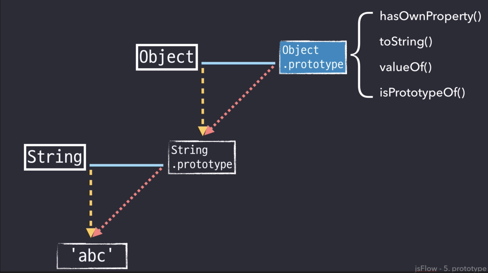
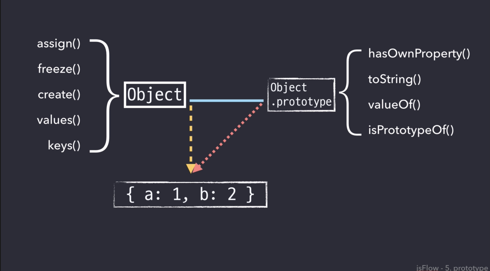

# 17.Prototype Inheritance and Prototype Chain

## Prototype Inheritance (프로토타입 상속)
- 프로토타입을 이용하면 객체와 객체를 연결하고 한쪽 방향으로 상속을 받는 형태를 만들 수가 있다. 자바스크립트에서 객체와 객체를 연결해서 상속 받는다는 것은 다른 말로 객체와 객체를 연결해 멤버 함수나 멤버 변수를 공유 한다는 뜻이다. 이런 점을 이용해 자바스크립트에서는 상속과 비슷한 효과를 얻는 것이다.

```
function Car (name, color) {
  this.name = name;
  this.color = color;
}

var redCar = new Car('redCar','red')
var pinkCar = new Car('pinkCar','pink')

#1 . 모든 Car에 getColor라는 기능을 추가하려고 한다!

1) 각 인스턴스에 메소드 추가 -> 반복 작업
redCar.getColor = function(){
  return this.color
}
pinkCar.getColor = function(){
  return this.color
}

2) 프로토타입에 메소드 추가 -> 모든 Car 메소드 추가 됨
Car.prototype.getColor = function(){
    return this.color
}

```

## Prototype Chain (프로토타입 체인)

- 최상단의 프로토타입은 Object!
- Object의 메소드는 모든 Object를 상속받는 객체에서 사용할 수 있음!


- Object.assign()과 같이 앞에 Object가 붙은 메소드가 많은 이유는 프로토타입 체인으로 인해 다른 객체에 상속되기 때문에 따로 정의 한 것이다!

## 프로토타입 식별자 룩업
- 프로토타입 체인을 통해 객체의 메서스나 속성을 찾아가는 과정을 프로토타입 룩업이라고 한다.
```
var a = {
    attr1: 'a'
};

var b = {
    __proto__: a,
    attr2: 'b'
};

var c = {
    __proto__: b,
    attr3: 'c'
};

c.attr1 // 'a'
```

1. c객체 내부에 attr1 속성을 찾는다. -> 없다.
2. c객체에 __proto__ 속성이 존재하는지 확인한다. -> 있다.
3. c객체의 __proto__ 속성이 참조하는 객체로 이동한다. -> b객체로 이동
4. b객체 내부에 attr1 속성을 찾는다. -> 없다.
5. b객체에 __proto__ 속성이 존재하는지 확인한다. -> 있다.
6. b객체의 __proto__ 속성이 참조하는 객체로 이동한다. -> a객체로 이동
7. a객체 내부에 attr1 속성을 찾는다. -> 있다.
8. 찾은 속성의 값을 리턴한다.


# ref
- [Javascript 핵심 개념 알아보기 - JS Flow](https://www.inflearn.com/course/%ED%95%B5%EC%8B%AC%EA%B0%9C%EB%85%90-javascript-flow/dashboard)
- [쉽게 이해하는 자바스크립트 프로토타입 체인](https://meetup.toast.com/posts/104)
