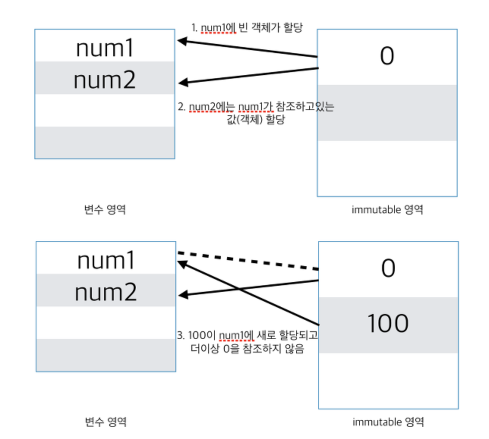
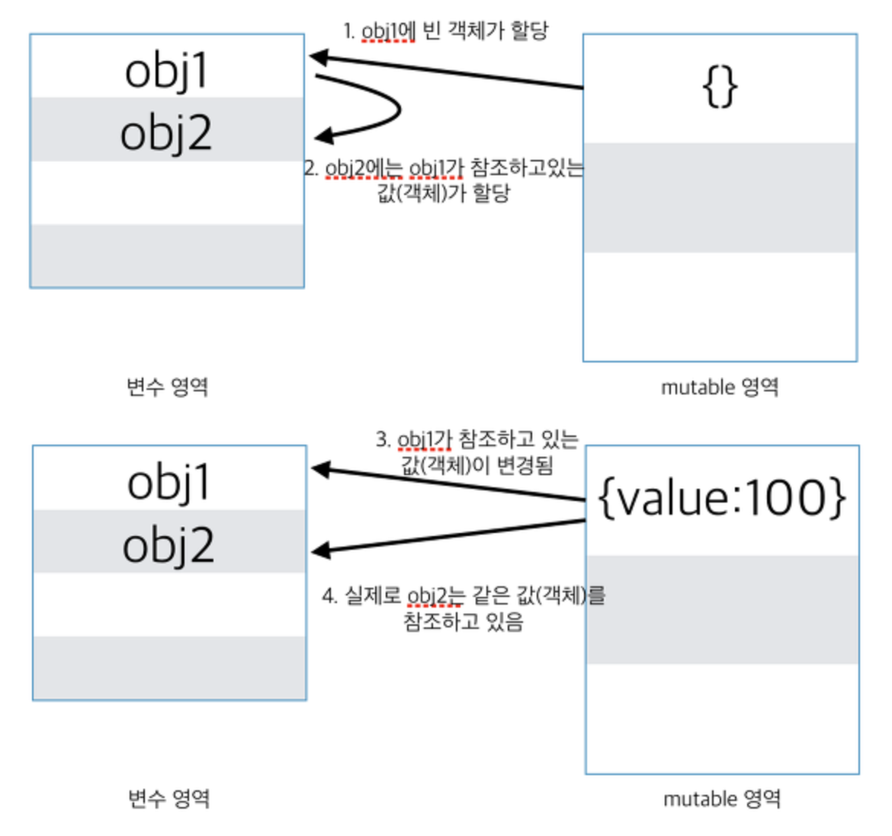

# 3. Value Types and Reference Types (값 타입과 참조 타입)

## value Type (primitive)

```js
let num1 = 0;
let num2 = num1;

num1 = 100;

console.log(num1); // 100
console.log(num2); // 0
```



> 첫번째 구문이 실행되면 메모리에 '0'이 생성되고 식별자 num1은 메모리에 생성된 '0'의 메모리 주소를 가리킨다. 그리고 두번째 구문이 실행되면 이전에 생성된 '0'을 수정하는 것이 아니라 새로운 '100' 메모리를 생성하고 식별자 num1을 가리킨다. 이때 '0'과 '100'은 모두 메모리에 존재하고 있다. 변수 num1은 '0'을 가리키고 있다가 '100'을 가리키도록 변경되었을 뿐이다.

## Reference Types (object)

```js
const obj1 = {};
const obj2 = obj1;

obj1.value = 100;

console.log(obj1); // { value: 100 }
console.log(obj2); // { value: 100 }
```



```js
const changeAgeAndReference = (person) => {
    person.age = 25;
    person = {
        name: 'John',
        age: 50
    };
    return person;
}

const personObj1 = {
    name: 'Alex',
    age: 30
};

const personObj2 = changeAgeAndReference(personObj1);

console.log(personObj1); // -> ?
console.log(personObj2); // -> ?
```


# ref
- [자바스크립트-변수-파라미터와-메모리-참조](https://yuddomack.tistory.com/entry/%EC%9E%90%EB%B0%94%EC%8A%A4%ED%81%AC%EB%A6%BD%ED%8A%B8-%EB%B3%80%EC%88%98-%ED%8C%8C%EB%9D%BC%EB%AF%B8%ED%84%B0%EC%99%80-%EB%A9%94%EB%AA%A8%EB%A6%AC-%EC%B0%B8%EC%A1%B0)